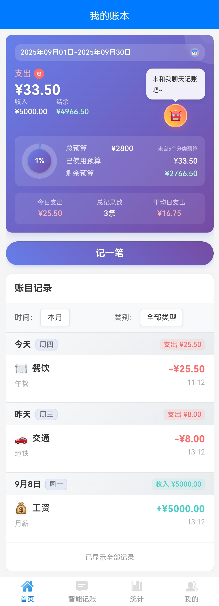

# 简帐 📊

<p align="center">
  
</p>

<p align="center">一款简洁优雅的本地记账应用，采用 uni-app 框架开发，支持多端运行。</p>

## 🚀 快速开始

### 📱 立即下载
<p align="center">
  <a href="https://github.com/timwenx/SimpleAccount/releases">
    
  </a>
</p>

> 🔥 **获取最新版本**: 前往 [Releases](https://github.com/timwenx/SimpleAccount/releases) 页面下载适合你设备的安装包

### 🎯 核心功能
- ✅ 本地数据存储，隐私安全
- ✅ 支持收支分类管理  
- ✅ 可视化数据统计
- ✅ CSV 数据导入导出
- ✅ 精美UI设计

---

## ✨ 功能特色

- 💰 **记账管理** - 快速记录收支，支持分类管理
- 📈 **数据统计** - 多维度数据分析，趋势图表展示
- 🏷️ **分类管理** - 自定义收支分类，图标管理
- 📊 **可视化图表** - 饼状图、柱状图展示消费趋势
- 💾 **数据导入导出** - 支持 CSV 格式数据备份
- 🎨 **精美界面** - 渐变色设计，流畅动画效果

## 🚀 技术栈

- **框架**: uni-app
- **语言**: JavaScript + Vue.js
- **存储**: 本地存储 (localStorage/Storage API)
- **UI**: 自定义组件 + CSS3 动画

## 📱 页面结构

```
pages/
├── index/          # 首页 - 收支记录列表
├── add/            # 添加记录页面
├── category/       # 分类页面
├── category-detail/ # 分类详情统计
├── category-manage/ # 分类管理
├── icon-manage/    # 图标管理
├── statistics/     # 统计分析页面
└── profile/        # 个人中心/设置页面
```

## 🛠️ 安装运行

###  开发环境

#### 环境要求
- Node.js 14+
- HBuilderX 或 VS Code
- uni-app 开发环境

#### 运行步骤

1. **克隆项目**
   ```bash
   git clone <repository-url>
   cd 简帐
   ```

2. **使用 HBuilderX**
   - 打开 HBuilderX
   - 文件 > 导入 > 从本地目录导入
   - 选择项目目录
   - 运行到浏览器或手机设备

3. **使用 VS Code**
   ```bash
   # 安装依赖
   npm install
   
   # 运行到 H5
   npm run dev:h5
   
   # 打包
   npm run build:h5
   ```

## 💡 主要功能说明

### 记账功能
- 快速添加收支记录
- 支持金额、分类、备注、时间记录
- 收支类型自动识别和统计

### 分类管理
- 自定义收支分类
- 丰富的图标库
- 支持分类的增删改查

### 数据统计
- 月度/年度收支统计
- 分类占比饼状图
- 收支趋势图表
- 详细的数据分析报告

### 数据管理
- CSV 格式数据导出
- 数据导入功能
- 本地数据清理

## 🎨 界面预览

应用采用现代化的渐变色设计风格：
- 主色调：蓝紫渐变 (#667eea → #764ba2)
- 卡片式布局，圆角设计
- 流畅的动画效果和交互反馈

### 应用截图

<div style="display: flex; flex-wrap: wrap; gap: 10px; justify-content: center;">

**首页 - 记账概览**



**统计分析**


**分类管理**


**分类详情**


**图标管理**


**个人中心**


</div>

### 界面特色
- 🎨 **渐变背景** - 优雅的蓝紫色渐变设计
- 📱 **响应式布局** - 适配不同屏幕尺寸
- 💫 **流畅动画** - 丰富的交互动效
- 🎯 **直观图表** - 清晰的数据可视化
- 🔄 **一致体验** - 统一的设计语言

## 📄 许可证

MIT License

## 🤝 贡献

欢迎提交 Issue 和 Pull Request！

## 📞 联系方式

如有问题或建议，欢迎联系开发者。
