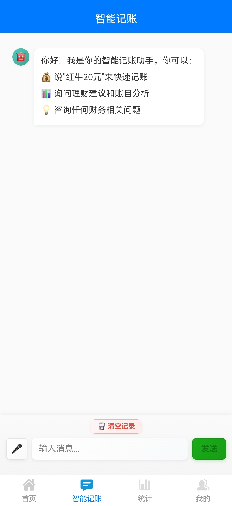
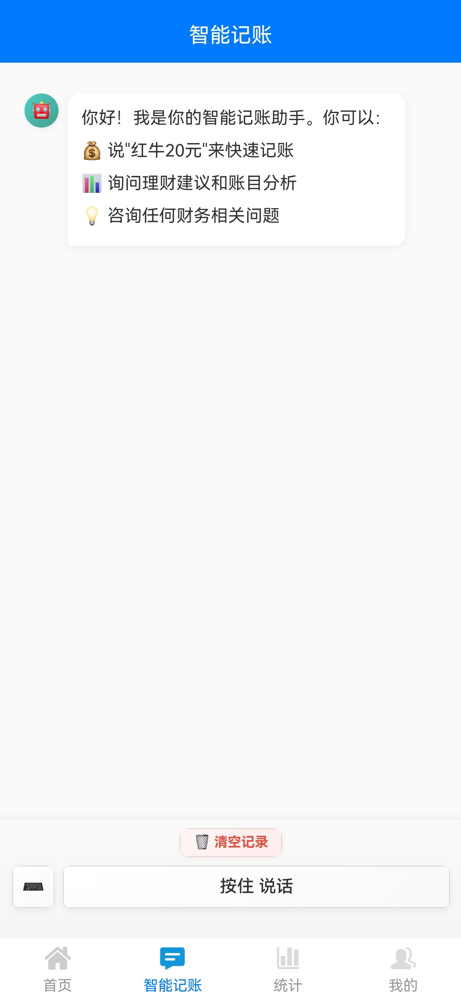
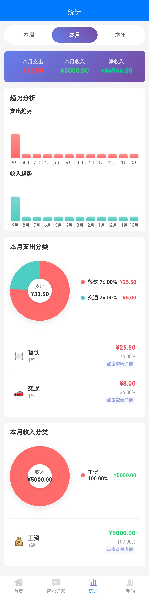

# 简帐 📊

<p align="center">
  
</p>

<p align="center">一款简洁优雅的本地记账应用，采用 uni-app 框架开发，支持多端运行。</p>

## 🚀 快速开始

### 📱 立即下载
<p align="center">
  <a href="https://github.com/timwenx/SimpleAccount/releases/">
    
  </a>
  &nbsp;&nbsp;
  <a href="https://gitee.com/timwenx/simple-account/releases/">
    
  </a>
</p>

> 🔥 **获取最新版本**: 
> - 🌍 **国际用户**: 前往 [GitHub Releases](https://github.com/timwenx/SimpleAccount/releases/) 下载
> - 🇨🇳 **国内用户**: 前往 [Gitee Releases](https://gitee.com/timwenx/simple-account/releases/) 下载

### 🎯 核心功能
- ✅ 本地数据存储，隐私安全
- ✅ 支持收支分类管理  
- ✅ 可视化数据统计
- ✅ CSV 数据导入导出
- ✅ 精美UI设计
- 🆕 **AI智能记账** - 语音/文字输入自动识别记账信息
- 🆕 **智能体配置** - 自定义AI模型和提示词
- 🆕 **语音识别** - 支持按住说话功能，自动转换语音为文字

---

## ✨ 功能特色

- 💰 **记账管理** - 快速记录收支，支持分类管理
- 📈 **数据统计** - 多维度数据分析，趋势图表展示
- 🏷️ **分类管理** - 自定义收支分类，图标管理
- 📊 **可视化图表** - 饼状图、柱状图展示消费趋势
- 💾 **数据导入导出** - 支持 CSV 格式数据备份
- 🎨 **精美界面** - 渐变色设计，流畅动画效果
- 🤖 **AI智能记账** - 自然语言输入，智能解析记账信息
- ⚙️ **智能体配置** - 支持自定义AI模型接口和提示词
- �️ **语音识别** - 支持按住说话，语音转文字记账
- �🎯 **丰富图标库** - 20+图标，支持自定义分类图标

## 🚀 技术栈

- **框架**: uni-app
- **语言**: JavaScript + Vue.js
- **存储**: 本地存储 (localStorage/Storage API)
- **UI**: 自定义组件 + CSS3 动画
- **AI集成**: OpenAI API / 兼容接口
- **语音识别**: 字节跳动火山引擎语音识别服务
- **智能解析**: 自然语言处理 + JSON结构化数据

## 📱 页面结构

```
pages/
├── index/          # 首页 - 收支记录列表
├── add/            # 添加记录页面
├── category/       # 分类页面
├── category-detail/ # 分类详情统计
├── category-manage/ # 分类管理
├── icon-manage/    # 图标管理
├── statistics/     # 统计分析页面
├── profile/        # 个人中心/设置页面
├── chat/           # AI智能记账聊天页面
├── ai-config/      # AI智能体配置页面
└── voice-config/   # 语音识别配置页面
```

## 🛠️ 安装运行

###  开发环境

#### 环境要求
- Node.js 14+
- HBuilderX 或 VS Code
- uni-app 开发环境

#### 运行步骤

1. **克隆项目**
   ```bash
   git clone <repository-url>
   cd 简帐
   ```

2. **使用 HBuilderX**
   - 打开 HBuilderX
   - 文件 > 导入 > 从本地目录导入
   - 选择项目目录
   - 运行到浏览器或手机设备

3. **使用 VS Code**
   ```bash
   # 安装依赖
   npm install
   
   # 运行到 H5
   npm run dev:h5
   
   # 打包
   npm run build:h5
   ```

## 💡 主要功能说明

### 记账功能
- 快速添加收支记录
- 支持金额、分类、备注、时间记录
- 收支类型自动识别和统计

### 分类管理
- 自定义收支分类
- 丰富的图标库（20+图标）
- 支持分类的增删改查
- 智能图标匹配推荐

### AI智能记账
- 自然语言输入记账信息
- 智能解析金额、分类、备注
- 支持单笔和批量记账识别  
- 自动创建新分类并匹配图标
- 多种AI模型接口支持

### 智能体配置
- 自定义AI接口地址和密钥
- 预设记账助手和财务顾问模板
- 支持自定义系统提示词
- 连接测试和状态监控

### 语音识别配置
- 支持字节跳动火山引擎语音识别服务
- 可配置App ID和Access Key
- 支持多种识别模型选择
- 可开启标点符号、数字转换等功能
- 内置演示模式，无需配置即可体验
- 🔗 [火山引擎控制台 - 语音识别服务](https://console.volcengine.com/ark/region:ark+cn-beijing/tts/recordingRecognition)

### 数据统计
- 月度/年度收支统计
- 分类占比饼状图
- 收支趋势图表
- 详细的数据分析报告

### 数据管理
- CSV 格式数据导出
- 数据导入功能
- 本地数据清理

## 🤖 AI智能记账功能

### ✨ 核心特性
- **自然语言输入**: 支持"今天早餐20元，打车15元"等自然语言记账
- **语音输入支持**: 按住说话按钮，自动将语音转换为文字后智能解析
- **智能解析**: 自动识别金额、分类、备注和时间信息
- **批量处理**: 一次输入多笔记账，智能分离处理
- **分类智能匹配**: 优先使用现有分类，必要时自动创建新分类
- **图标自动匹配**: 新分类自动匹配合适的图标

### 🔧 配置说明

#### AI智能体配置
1. **进入设置**: 个人中心 → AI智能体配置
2. **API配置**: 输入OpenAI或兼容接口的API地址和密钥
3. **模型选择**: 支持GPT-3.5、GPT-4等主流模型
4. **提示词自定义**: 可使用预设模板或自定义智能体指令
5. **测试连接**: 确保API配置正确

#### 语音识别配置
1. **进入设置**: 个人中心 → 语音识别配置
2. **选择模式**: 
   - **演示模式**: 无需配置，可直接体验语音录制功能
   - **火山引擎模式**: 需配置API密钥，支持真实语音识别
3. **API配置**: 输入字节跳动App ID和Access Key
4. **识别设置**: 
   - 选择识别模型（bigmodel/general）
   - 开启标点符号识别
   - 开启数字转换功能
   - 开启说话人识别（可选）
5. **测试配置**: 确保语音识别服务正常

### 💬 使用示例

#### 文字输入示例
```
用户输入: "今天中午吃饭花了35元，下午买衣服200元"
AI解析: 
- 支出 35元 餐饮 备注:中午吃饭 时间:今天中午
- 支出 200元 购物 备注:买衣服 时间:今天下午
```

#### 语音输入示例
```
用户语音: "早上打车花了二十五块钱"
语音识别: "早上打车花了二十五块钱"
AI解析: 
- 支出 25元 交通 备注:打车 时间:早上
```

### 🎯 智能体模板
- **记账助手**: 专门解析记账信息，严格按照JSON格式返回
- **财务顾问**: 除记账外，还能提供理财建议和财务分析

## 🎙️ 语音识别功能

### ✨ 核心特性
- **按住说话**: 在聊天页面长按语音按钮开始录音
- **实时识别**: 松开按钮自动识别并转换为文字
- **智能解析**: 语音转文字后自动进行记账信息解析
- **多种模式**: 支持演示模式和真实识别模式
- **高准确率**: 基于字节跳动火山引擎语音识别技术

### 🔧 配置选项
- **识别模型**: bigmodel（大模型）/ general（通用模型）
- **标点符号**: 自动添加标点符号
- **数字转换**: 将语音中的数字词汇转换为阿拉伯数字
- **说话人识别**: 多人对话场景下的说话人区分

### 🚀 使用流程
1. **配置服务**: 个人中心 → 语音识别配置 → 输入API密钥
2. **开始录音**: 聊天页面 → 切换到语音模式 → 按住说话按钮
3. **语音输入**: 清晰说出记账信息，如"今天午餐花了30元"
4. **自动识别**: 松开按钮，系统自动识别语音并转换为文字
5. **智能解析**: AI自动解析记账信息并生成记录

### 🎪 演示模式
- **零配置体验**: 无需API密钥即可体验语音录制流程
- **功能完整**: 支持语音录制、界面交互等所有功能
- **快速上手**: 新用户可快速了解语音记账的操作方式

## 🎨 图标管理系统

### 📦 图标资源
- **总数量**: 20+ emoji图标
- **分类覆盖**: 餐饮、交通、购物、娱乐、医疗、教育等12大类
- **智能推荐**: 根据分类名称自动推荐合适图标
- **自由选择**: 支持从图标库中自由选择任意图标

### 🔄 分类图标
- 餐饮美食: 🍽️ 🍕 🍔 🍟 🍗 等20+图标
- 交通出行: 🚗 🚙 🚌 ✈️ 🚲 等30+图标  
- 购物消费: 🛍️ 🛒 💳 👕 👜 等25+图标
- 娱乐休闲: 🎬 🎮 🎲 🏀 ⚽ 等30+图标
- 更多分类持续更新...

## 🎨 界面预览

应用采用现代化的渐变色设计风格：
- 主色调：蓝紫渐变 (#667eea → #764ba2)
- 卡片式布局，圆角设计
- 流畅的动画效果和交互反馈

### 应用截图

<div style="display: flex; flex-wrap: wrap; gap: 10px; justify-content: center;">

**首页 - 记账概览**


**AI智能记账 - 自然语言输入**



**智能记账 - 批量识别**


**智能记账 - 确认记录**


**智能体配置 - AI模型设置**


**语音识别配置 - 按住说话设置**


**按住说话演示**



**按住说话演示2**


**统计分析**



**分类详情**


**图标管理**


**预算管理**


**个人中心**


</div>

### 界面特色
- 🎨 **渐变背景** - 优雅的蓝紫色渐变设计
- 📱 **响应式布局** - 适配不同屏幕尺寸
- 💫 **流畅动画** - 丰富的交互动效
- 🎯 **直观图表** - 清晰的数据可视化
- 🔄 **一致体验** - 统一的设计语言
- 🤖 **智能交互** - AI聊天界面，自然语言记账
- �️ **语音交互** - 按住说话，语音转文字记账功能
- �🎭 **图标丰富** - 20+emoji图标，涵盖各行各业

## 📄 许可证

MIT License

## 🤝 贡献

欢迎提交 Issue 和 Pull Request！

## 📞 联系方式

如有问题或建议，欢迎联系开发者。
